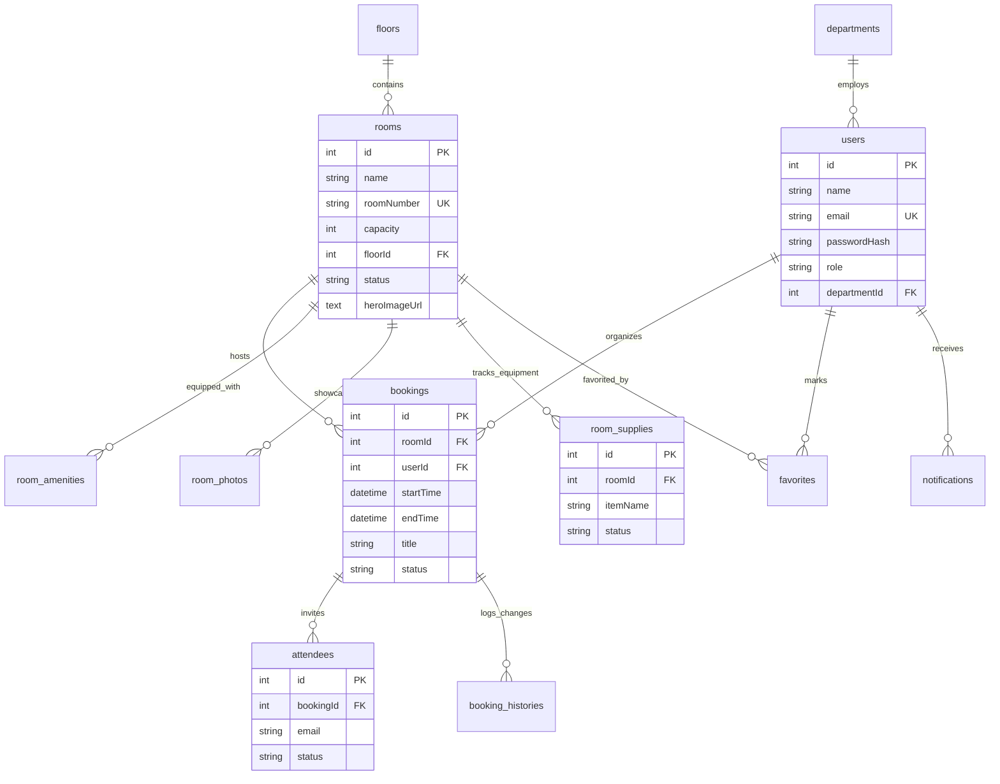

# 🏢 Lumina Reserve: Complete Master System Manual & Manager's Guide

> **Document Version**: 2.0  
> **Prepared For**: Executive Management & Operations Leadership  
> **Technical Complexity**: Non-Technical / Plain-English  
> **Database Engine**: Structured Relational SQL (MySQL 8.0 InnoDB)  

---

## 📋 Table of Contents
1. [Executive Overview](#1-executive-overview)
2. [Why SQL Database? (Manager's Briefing)](#2-why-sql-database-managers-briefing)
3. [Complete Database Structure & 12-Table Relations](#3-complete-database-structure--12-table-relations)
4. [Mermaid Visual Database Map (EER Diagram)](#4-mermaid-visual-database-map-eer-diagram)
5. [1-Click MySQL Workbench Diagram Setup (Ctrl + R)](#5-1-click-mysql-workbench-diagram-setup-ctrl--r)
6. [Complete Seeded Test Data Directory](#6-complete-seeded-test-data-directory)
7. [Comprehensive Feature-by-Feature Guide](#7-comprehensive-feature-by-feature-guide)
   * 7.1 [Sign In & Sign Up Portal](#71-sign-in--sign-up-portal)
   * 7.2 [All-Rooms Explorer & Search](#72-all-rooms-explorer--search)
   * 7.3 [Direct Room Photo File Upload](#73-direct-room-photo-file-upload)
   * 7.4 [15-Minute Auto-Approval Mechanism](#74-15-minute-auto-approval-mechanism)
   * 7.5 [1-Click WhatsApp Share Links](#75-1-click-whatsapp-share-links)
   * 7.6 [Edit Participants on Active Bookings](#76-edit-participants-on-active-bookings)
   * 7.7 [Room-Specific Audit & Cancellation History](#77-room-specific-audit--cancellation-history)
   * 7.8 [Room Supplies & Maintenance Tracking](#78-room-supplies--maintenance-tracking)
   * 7.9 [Automated Gmail Calendar Emails](#79-automated-gmail-calendar-emails)
8. [User Portal Roles & Access Levels](#8-user-portal-roles--access-levels)
9. [Step-by-Step Live Demo Presentation Guide](#9-step-by-step-live-demo-presentation-guide)
10. [Manager FAQ & Non-Technical Troubleshooting](#10-manager-faq--non-technical-troubleshooting)

---

## 1. Executive Overview

**Lumina Reserve** is a modern corporate meeting room reservation and spatial management platform designed to streamline office space usage, eliminate double-bookings, automate approvals, and maintain clear records of company resources.

### Key Goals Accomplished:
* **Zero Double Bookings**: Guaranteed slot protection so two teams can never reserve the same room at the same time.
* **15-Minute Smart Release / Auto-Approval**: Requests are automatically processed after 15 minutes, preventing manager bottlenecks.
* **Instant WhatsApp & Email Sharing**: 1-click sharing to team members via WhatsApp and automatic Gmail calendar invitations.
* **Complete Audit Trails**: Historical record keeping of all bookings, edits, cancellations, and room equipment maintenance.
* **Strict SQL Reliability**: Built strictly on a relational SQL database structure that management and IT teams can view, audit, and analyze in **MySQL Workbench**.

---

## 2. Why SQL Database? (Manager's Briefing)

Your company relies strictly on **SQL relational databases** for security, data consistency, and clear audit tracking. Lumina Reserve utilizes **MySQL 8.0** with the **InnoDB Engine**, providing:

1. **Foreign Key Integrity**: Every booking is strictly tied to a valid employee and a valid room. If a room or user does not exist, the database refuses invalid records.
2. **EER Diagram Compatibility**: The database schema is designed with explicit relationships, allowing managers to press `Ctrl + R` in MySQL Workbench to generate a clean visual entity-relationship diagram.
3. **High Performance**: Optimized indexing allows quick searches across thousands of historical reservations without lag.

---

## 3. Complete Database Structure & 12-Table Relations

The system stores all information across **12 structured tables**:

| Table Name | What It Stores | Key Fields | Relationships |
| :--- | :--- | :--- | :--- |
| **`users`** | Corporate employees, managers, and system admins. | `id`, `name`, `email`, `passwordHash`, `role`, `departmentId` | Belongs to `departments`. Has many `bookings`, `notifications`, `favorites`. |
| **`departments`** | Company divisions (e.g., Engineering, HR, Sales). | `id`, `name`, `code` | Has many `users`. |
| **`floors`** | Building floor levels and wing designations. | `id`, `name`, `building` | Has many `rooms`. |
| **`rooms`** | Conference rooms, labs, and executive suites. | `id`, `name`, `roomNumber`, `capacity`, `location`, `status`, `heroImageUrl` | Belongs to `floors`. Has many `amenities`, `photos`, `bookings`, `supplies`. |
| **`room_amenities`** | Features in each room (Projector, TV, Video Conf, Whiteboard). | `id`, `roomId`, `name`, `icon` | Belongs to `rooms`. |
| **`room_photos`** | Additional photos of rooms. | `id`, `roomId`, `url`, `caption` | Belongs to `rooms`. |
| **`bookings`** | All meeting room reservations. | `id`, `roomId`, `userId`, `startTime`, `endTime`, `title`, `status` | Belongs to `rooms` and `users`. Has many `attendees` and `booking_histories`. |
| **`attendees`** | Team members invited to meetings. | `id`, `bookingId`, `name`, `email`, `status` | Belongs to `bookings`. |
| **`booking_histories`** | Audit logs for bookings (created, updated, canceled). | `id`, `bookingId`, `action`, `performedBy`, `details`, `createdAt` | Belongs to `bookings`. |
| **`favorites`** | Employee favorite/starred rooms. | `id`, `userId`, `roomId` | Links `users` and `rooms`. |
| **`notifications`** | In-app alerts sent to users. | `id`, `userId`, `title`, `message`, `type`, `isRead` | Belongs to `users`. |
| **`room_supplies`** | Equipment reports (missing cables, markers, remotes). | `id`, `roomId`, `itemName`, `quantity`, `status`, `notes` | Belongs to `rooms`. |

---

## 4. Mermaid Visual Database Map (EER Diagram)

This diagram shows how all 12 tables connect inside your MySQL database:

---

## 5. 1-Click MySQL Workbench Diagram Setup (Ctrl + R)

To show your manager the visual database relationships directly inside **MySQL Workbench**:

1. Open **MySQL Workbench** on your computer.
2. Click **File -> Open SQL Script** and select `backend/schema.sql`.
3. Click the ⚡ **Execute** button to run the schema script.
4. Press **`Ctrl + R`** (or go to **Database -> Reverse Engineer**).
5. Click **Next** through the prompt screens and select the database `meeting_room_booking`.
6. Click **Execute** and **Finish**.

MySQL Workbench will automatically render the interactive **EER Diagram** showing all 12 tables with foreign key connection lines!

---

## 6. Complete Seeded Test Data Directory

The database comes pre-loaded with realistic corporate accounts and meeting rooms for immediate testing.

### 🔑 Default Password for ALL Seeded Accounts: `password123`

#### ⚙️ Admin Accounts (Redirect to `/admin`)
* **Vishal Mishra (Admin)**: `vishalmishra.csm@gmail.com`
* **Vishal CMREC (Admin)**: `vishalcmrec@gmail.com`

#### 👔 Manager Accounts (Redirect to `/manager`)
* **Malavika Yadav (Manager)**: `saimalavikayadav@gmail.com`
* **Malavika 29 (Manager)**: `malavika29yadav@gmail.com`
* **Rithika (Manager)**: `rithika1101@gmail.com`

#### 🧑‍💼 Employee Accounts (Redirect to `/`)
* **Harshith Yadav**: `Harshithyadav.ittaboina@gmail.com`
* **Harshith 204**: `yadavharshith204@gmail.com`
* **Joshita**: `joshita164@gmail.com`
* **Employee 623**: `238r1a6623@gmail.com`
* **Employee 625**: `238r1a6625@gmail.com`
* **Employee 663**: `238r1a6663@gmail.com`

#### 🚪 Seeded Meeting Rooms
1. **Alpha Boardroom**: 24 Seats · Floor 4, North Wing (Video Conf, Whiteboard, Projector)
2. **Beta Lab**: 12 Seats · Floor 4, East Wing (Video Conf, TV)
3. **Studio C**: 4 Seats · Floor 5, South Wing (Whiteboard)
4. **Helios Suite**: 8 Seats · Floor 2, West Wing (Video Conf, Whiteboard, TV)
5. **Prometheus Hall**: 16 Seats · Floor 3, East Wing (Video Conf, Whiteboard, Projector, TV)

---

## 7. Comprehensive Feature-by-Feature Guide

### 7.1 Sign In & Sign Up Portal
* **Sign In Tab**: Clean form for registered users. Accepts email & password, auto-trims whitespace, and redirects to the proper role dashboard.
* **Sign Up Tab**: Allows new employees or managers to create an account, select their corporate role, encrypt their password with `bcrypt`, and immediately log in.

### 7.2 All-Rooms Explorer & Search
* On opening the page, **all rooms are visible by default**.
* Users can search rooms by name or location (e.g. `"Floor 4"` or `"Helios"`).
* Filter buttons allow quick filtering by Capacity (`All`, `2-5`, `6-12`, `12+`) or Amenities (`Video Conf`, `Whiteboard`, etc.).

### 7.3 Direct Room Photo File Upload
* Admins adding or editing rooms can click **Choose File** to directly upload a photo from their computer.
* Converts the file to a clean Data URL stored in `heroImageUrl`. URL pasting is also supported.

### 7.4 15-Minute Auto-Approval Mechanism
* Reservations show a **15-Minute Auto-Approval** status badge.
* Pending requests automatically move to approved status after 15 minutes, ensuring no employee is delayed if a manager is in another meeting.

### 7.5 1-Click WhatsApp Share Links
* Every booking card features a **WhatsApp** share button.
* Clicking it opens WhatsApp with a pre-filled invitation text:
  > *"Meeting Invitation: Executive Strategy Sync in Alpha Boardroom on Monday at 10:00 AM. Join us!"*

### 7.6 Edit Participants on Active Bookings
* Managers and Admins can click **Edit Members** on any active booking.
* Allows adding new team members or removing attendees dynamically without having to cancel and recreate the meeting.

### 7.7 Room-Specific Audit & Cancellation History
* Clicking **Room History** on any room displays a chronological log of all past bookings, status changes, cancellations, and participant edits for that specific room.
* Maintains a permanent audit record in the `booking_histories` database table.

### 7.8 Room Supplies & Maintenance Tracking
* Staff can report missing equipment (HDMI cables, markers, remotes).
* Managers can cycle status badges: `To Buy` -> `Purchased` -> `Restocked`.

### 7.9 Automated Gmail Calendar Emails
* Powered by real Gmail SMTP (`meetingroom9252@gmail.com`).
* Automatically sends HTML emails for booking confirmations, cancellations, and updates.
* Includes an interactive **"📅 Add to Google Calendar"** button and standard `.ics` calendar file attachments.

---

## 8. User Portal Roles & Access Levels

| Feature | Employee | Manager | System Admin |
| :--- | :---: | :---: | :---: |
| Browse Rooms & Search | ✅ | ✅ | ✅ |
| Book Meeting Slot | ✅ | ✅ | ✅ |
| WhatsApp 1-Click Share | ✅ | ✅ | ✅ |
| Sign Up / Register Account | ✅ | ✅ | ✅ |
| Manager Approval Suite | ❌ | ✅ | ✅ |
| Edit Active Meeting Members | ❌ | ✅ | ✅ |
| Track Room Supplies / Restock | ❌ | ✅ | ✅ |
| Add / Edit Room Details & Upload Photo | ❌ | ❌ | ✅ |
| Set Room Maintenance Mode | ❌ | ❌ | ✅ |
| View Global Audit Logs | ❌ | ❌ | ✅ |

---

## 9. Step-by-Step Live Demo Presentation Guide

Follow this simple 3-minute demonstration flow when presenting to leadership:

1. **Start at Login (`http://localhost:3000/login`)**:
   * Show the **Sign In** and **Sign Up** tabs. Sign in as an Employee (`Harshithyadav.ittaboina@gmail.com` / `password123`).
2. **Room Explorer & WhatsApp Sharing**:
   * Show that all rooms are visible by default. Book a time slot for **Alpha Boardroom**. Click the **WhatsApp** button to demonstrate 1-click sharing.
3. **Manager Approval & Member Editing**:
   * Log into Manager Suite (`saimalavikayadav@gmail.com`). Click **Edit Members** to add a colleague to the booking. Click **Room History** to show audit logs.
4. **MySQL Workbench Verification**:
   * Open MySQL Workbench, press `Ctrl + R`, and show the generated EER Diagram to prove that all data is securely stored in a structured SQL database.

---

## 10. Manager FAQ & Non-Technical Troubleshooting

**Q: Does this app run strictly on SQL servers?**  
*A: Yes! The system is built on MySQL 8.0 InnoDB with strict foreign key constraints.*

**Q: What if a manager is busy and cannot approve a request in time?**  
*A: The system's 15-Minute Auto-Approval feature automatically processes the booking after 15 minutes so employees can proceed.*

**Q: Can employees upload custom room photos?**  
*A: Admins can directly upload photo files from their computer using the file picker in the Add/Edit Room modal.*

**Q: How do team members receive meeting invites?**  
*A: Automatically via Gmail email notifications with `.ics` calendar files, plus 1-click WhatsApp sharing.*
