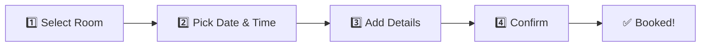
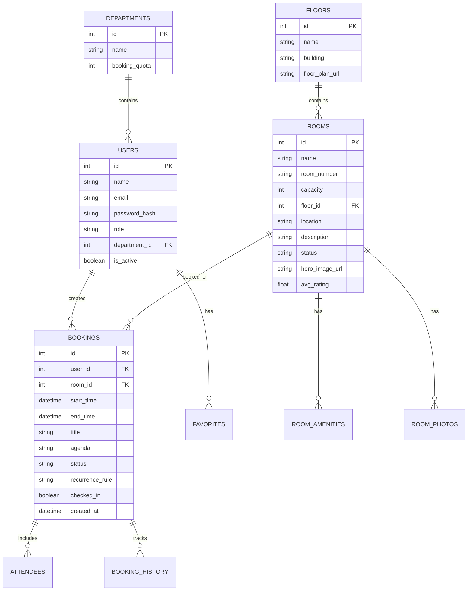

# 🏢 Meeting Room Booking System — Analysis & Enhanced Suggestions

## 📋 PDF Document Summary

Your document outlines a solid foundation with **6 User Features** and **6 Admin Features**:

### What You Already Have (From PDF)

| # | User Features | Admin Features |
|---|---------------|----------------|
| 1 | Registration & Login | Manage Meeting Rooms |
| 2 | Meeting Room Management (view) | Add / Edit / Delete Rooms |
| 3 | Room Search & Filtering | View All Bookings |
| 4 | Room Booking | Approve / Reject Requests |
| 5 | Booking History | Generate Reports |
| 6 | Cancel / Modify Bookings | Manage Users |
| 7 | Email / Notification Reminders | — |

**Tech Stack Mentioned:** HTML, CSS, JavaScript, Bootstrap (Frontend) · Java, Spring Boot (Backend) · MySQL (Database)

**Roles Mentioned:** Administrator, Employee/User, Manager/Approver (Optional)

---

## ✅ What's Good in Your Current Plan

- Double-booking prevention is covered
- Approval workflow (optional) is a great enterprise feature
- Reporting with export (PDF/Excel) is valuable
- Amenity-based filtering is practical
- Notification system is planned

---

## 🔴 Gaps & Missing Pieces in the Current Plan

> [!WARNING]
> These are significant gaps that need addressing for a production-quality system serving 200 employees.

### 1. No Real-Time Availability View
Your current plan mentions "availability status" but doesn't describe a **live calendar/timeline view** — users need to SEE room schedules visually, not just get a yes/no.

### 2. No Recurring Meeting Support
A huge gap — most office meetings repeat weekly (standups, sprint planning, 1-on-1s). Without recurrence, users will rebook the same room **every single week**.

### 3. No Multi-Floor / Building Layout
For 200 people, you likely have rooms across floors or buildings. There's no floor-plan or map-based selection described.

### 4. No Conflict Resolution
What happens if two people try to book the same slot simultaneously? There's no optimistic locking or queue mechanism described.

### 5. No Integration Plan
No mention of calendar sync (Outlook/Google Calendar), SSO (Active Directory/LDAP), or communication tools (Teams/Slack).

### 6. No Mobile Responsiveness Plan
200 employees will often book from phones — but Bootstrap alone won't deliver a BookMyShow-level mobile experience.

### 7. No Walk-in / Instant Booking
What about unplanned meetings? No way to quickly grab an available room right now.

### 8. No Check-in / No-Show Handling
If someone books but doesn't show up, the room stays blocked. This is a major waste for 200 people sharing limited rooms.

---

## 🎬 BookMyShow-Style UI/UX Enhancements

> [!IMPORTANT]
> To achieve the "BookMyShow feel," focus on these UI patterns that make their platform so engaging.

### 🎯 Visual Room Selection (Like Seat Selection)

```
┌─────────────────────────────────────────────────────┐
│  🏢 3rd Floor — Conference Rooms                    │
│                                                     │
│  ┌─────────┐  ┌─────────┐  ┌─────────┐            │
│  │ Olympus  │  │ Athena  │  │ Apollo  │            │
│  │ 🟢 Free  │  │ 🔴 Busy │  │ 🟡 Soon │            │
│  │ 12 seats │  │ 8 seats │  │ 6 seats │            │
│  │ 📽️ 📺 📹  │  │ 📽️ 📋   │  │ 📹 📋   │            │
│  └─────────┘  └─────────┘  └─────────┘            │
│                                                     │
│  🏢 2nd Floor — Huddle Spaces                       │
│  ┌─────────┐  ┌─────────┐                          │
│  │ Zen Pod  │  │ Focus   │                          │
│  │ 🟢 Free  │  │ 🟢 Free │                          │
│  │ 4 seats  │  │ 2 seats │                          │
│  └─────────┘  └─────────┘                          │
└─────────────────────────────────────────────────────┘
```

### 🕐 Timeline Slot Picker (Like Show Timings)
Instead of a boring form, show time slots as **clickable chips** (just like movie showtimes):

```
Today, June 17          Tomorrow, June 18         Thu, June 19

 9:00 AM   9:30 AM      9:00 AM   9:30 AM       9:00 AM
[  ✅  ]  [  ✅  ]     [  ❌  ]  [  ✅  ]      [  ✅  ]

10:00 AM  10:30 AM     10:00 AM  10:30 AM      10:00 AM
[  ✅  ]  [  ❌  ]     [  ✅  ]  [  ✅  ]      [  ❌  ]
```

### 🎨 Rich Room Cards (Like Movie Cards)
Each room should have:
- **Hero image/photo** of the room
- **Star rating** from past users
- **Quick amenity icons** (projector, TV, whiteboard, video conf)
- **Live status badge** (Available Now / In Use / Available in 30 min)
- **Capacity indicator** with visual icon
- **One-click "Book Now"** button

### 📱 Multi-Step Booking Flow (Like BookMyShow Checkout)



Each step on its own clean screen with progress indicator — not a single overwhelming form.

---

## 🚀 Enhanced Feature Suggestions (Beyond Your PDF)

### 🔄 Smart Booking Features

| # | Feature | Description | Priority |
|---|---------|-------------|----------|
| 1 | **Recurring Bookings** | Daily/Weekly/Monthly repeat with conflict detection | 🔴 Critical |
| 2 | **Quick Book / Instant Book** | One-tap "Book Now" for walk-in meetings | 🔴 Critical |
| 3 | **Smart Suggestions** | AI-powered room recommendations based on team size, past preferences, and amenity needs | 🟡 High |
| 4 | **Waitlist System** | Join a waitlist when a room is full — auto-notify if it opens up | 🟡 High |
| 5 | **Buffer Time** | Auto-add 5-10 min buffer between bookings for room turnover | 🟢 Medium |
| 6 | **Favorite Rooms** | Users can star/favorite frequently used rooms for quick access | 🟢 Medium |
| 7 | **Booking Templates** | Save frequent meeting setups (e.g., "Weekly Standup — Room Apollo, Mon 9 AM, 30 min") | 🟢 Medium |

### 📍 Space Intelligence

| # | Feature | Description | Priority |
|---|---------|-------------|----------|
| 8 | **Interactive Floor Plan** | Clickable map showing room locations with live status colors | 🟡 High |
| 9 | **Room Photos & 360° View** | Actual photos of each room so users know what to expect | 🟡 High |
| 10 | **QR Code at Room Door** | Scan QR to check-in, extend booking, or instant-book if available | 🟡 High |
| 11 | **Room Display Integration** | Tablet/screen outside each room showing current & next booking | 🟢 Medium |

### 🤝 Collaboration Features

| # | Feature | Description | Priority |
|---|---------|-------------|----------|
| 12 | **Invite Attendees** | Add team members to booking — they get calendar invites | 🔴 Critical |
| 13 | **Meeting Agenda** | Attach meeting purpose/agenda to the booking | 🟡 High |
| 14 | **Attendee RSVP** | Invitees can accept/decline — auto-downsize room if fewer attend | 🟢 Medium |
| 15 | **Delegate Booking** | Admins/EAs can book on behalf of managers | 🟡 High |

### 📊 Smart Analytics Dashboard (Admin)

| # | Feature | Description | Priority |
|---|---------|-------------|----------|
| 16 | **Real-Time Occupancy Dashboard** | Live view of all rooms: occupied / free / upcoming | 🔴 Critical |
| 17 | **Heatmap Analytics** | Visual heatmap showing peak booking hours and popular rooms | 🟡 High |
| 18 | **No-Show Tracking** | Track bookings where users didn't check in — auto-release after X mins | 🔴 Critical |
| 19 | **Utilization Score** | Each room gets a % utilization score — helps decide if you need more/fewer rooms | 🟡 High |
| 20 | **Cost per Meeting** | If rooms have associated costs, track expense per team/department | 🟢 Medium |

### 🔔 Advanced Notifications

| # | Feature | Description | Priority |
|---|---------|-------------|----------|
| 21 | **Push Notifications** | Browser/mobile push in addition to email | 🟡 High |
| 22 | **Slack/Teams Integration** | Book rooms via `/book` slash command in chat | 🟡 High |
| 23 | **Smart Reminders** | "Your meeting starts in 15 min — Room Olympus, 3rd Floor" with directions | 🟡 High |
| 24 | **Conflict Alerts** | "You have a booking overlap at 3 PM — resolve?" | 🔴 Critical |

### 🔒 Enterprise & Security

| # | Feature | Description | Priority |
|---|---------|-------------|----------|
| 25 | **SSO / Active Directory** | Login with company credentials (LDAP/SAML/OAuth) | 🔴 Critical |
| 26 | **Role-Based Access (RBAC)** | Department heads can only manage their floor/team rooms | 🟡 High |
| 27 | **Audit Trail** | Complete log of who booked/modified/cancelled what and when | 🟡 High |
| 28 | **Department-wise Booking Quotas** | Limit bookings per team to ensure fair access | 🟢 Medium |
| 29 | **Visitor Management** | External guests? Track visitor bookings separately with security clearance | 🟢 Medium |

---

## 🛠️ Recommended Tech Stack (Upgraded)

> [!TIP]
> Your PDF suggests Bootstrap + Java Spring Boot + MySQL. Here's an enhanced stack recommendation for a modern, BookMyShow-quality experience.

### Option A: Modern Full-Stack (Recommended for BookMyShow-feel)

| Layer | Technology | Why |
|-------|-----------|-----|
| **Frontend** | React.js / Next.js + Tailwind CSS | Component-based UI, SSR, animations, mobile-responsive |
| **Backend** | Node.js (Express/Fastify) or Spring Boot | REST APIs, WebSocket for real-time updates |
| **Database** | PostgreSQL | Better JSON support, advanced queries, room for scale |
| **Cache** | Redis | Real-time availability, session management, conflict prevention |
| **Auth** | Keycloak / Auth0 / Spring Security | SSO, LDAP, OAuth2, RBAC |
| **Notifications** | Firebase Cloud Messaging + Nodemailer | Push + Email |
| **Calendar Sync** | Google Calendar API / Microsoft Graph API | Two-way sync |
| **File Storage** | AWS S3 / MinIO | Room photos, report exports |
| **Real-time** | WebSockets (Socket.IO) | Live room status updates |
| **Deployment** | Docker + Kubernetes or AWS ECS | Containerized, scalable |

### Option B: Keep Java Stack (If team prefers Java)

| Layer | Technology |
|-------|-----------|
| **Frontend** | React.js + Material UI (or Thymeleaf if SSR) |
| **Backend** | Spring Boot + Spring Security + Spring WebSocket |
| **Database** | MySQL 8+ with connection pooling (HikariCP) |
| **Cache** | Redis (via Spring Data Redis) |
| **Auth** | Spring Security + JWT + LDAP |
| **Notifications** | Spring Mail + Firebase |

---

## 📐 Suggested Database Schema (Key Entities)



---

## 📱 Key Screens to Build

1. **🏠 Home Dashboard** — Today's schedule, quick-book, upcoming meetings
2. **🔍 Room Explorer** — Grid/list of rooms with filters (BookMyShow movie listing style)
3. **📅 Room Detail + Calendar** — Room info + interactive weekly calendar
4. **🎫 Booking Flow** — Multi-step wizard (select room → pick time → add details → confirm)
5. **📋 My Bookings** — Active, upcoming, past bookings with actions
6. **🗺️ Floor Plan View** — Interactive map with live room status
7. **📊 Admin Dashboard** — Utilization charts, heatmaps, pending approvals
8. **⚙️ Admin Room Management** — CRUD for rooms with photo upload
9. **👥 Admin User Management** — User list, roles, departments
10. **📈 Reports Page** — Filterable reports with chart visualizations + export

---

## 🎯 Implementation Priority (Phased Rollout)

### Phase 1 — MVP (4-6 weeks)
- User auth (login/register with company email)
- Room listing with search & filters
- Basic booking flow with conflict prevention
- My bookings (view, cancel, modify)
- Admin CRUD for rooms
- Email notifications

### Phase 2 — Enhanced Experience (3-4 weeks)
- BookMyShow-style UI with room cards & time slot chips
- Interactive floor plan
- Recurring bookings
- Invite attendees
- Admin dashboard with basic analytics
- Push notifications

### Phase 3 — Enterprise Features (3-4 weeks)
- SSO / Active Directory integration
- Approval workflows
- Check-in via QR code + no-show auto-release
- Advanced reporting with heatmaps
- Slack/Teams integration
- Waitlist system

### Phase 4 — Intelligence (2-3 weeks)
- Smart room suggestions
- Predictive analytics
- Booking templates
- Cost tracking
- Visitor management
