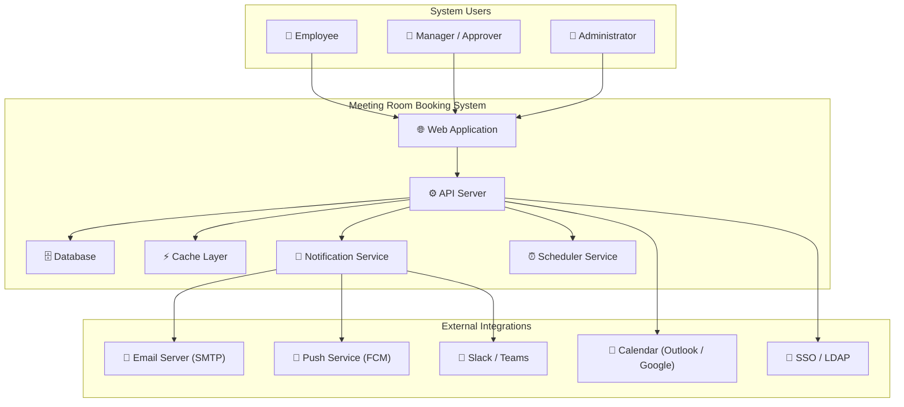
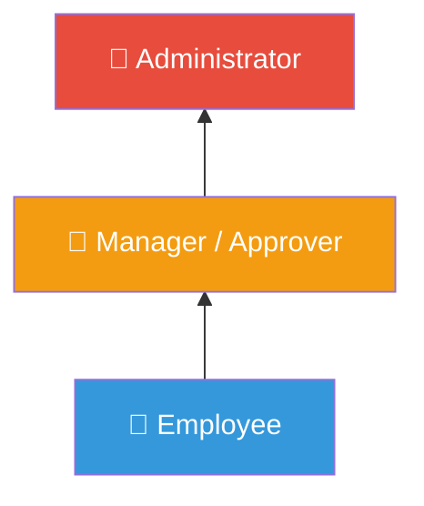
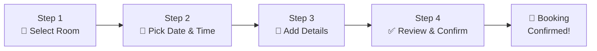

# Meeting Room Booking System
## Software Requirements Specification (SRS) Document

**Version:** 1.0  
**Date:** June 18, 2026  
**Prepared For:** Internal Office Use (~200 Employees)  
**Document Status:** Draft  

---

## Table of Contents

1. [Introduction](#1-introduction)
2. [System Overview](#2-system-overview)
3. [User Roles & Permissions](#3-user-roles--permissions)
4. [Functional Requirements — User Features](#4-functional-requirements--user-features)
5. [Functional Requirements — Admin Features](#5-functional-requirements--admin-features) *(Part 2)*
6. [Non-Functional Requirements](#6-non-functional-requirements) *(Part 2)*
7. [System Architecture](#7-system-architecture) *(Part 2)*
8. [Database Design](#8-database-design) *(Part 2)*
9. [API Specification](#9-api-specification) *(Part 2)*
10. [UI/UX Specification](#10-uiux-specification) *(Part 3)*
11. [Integration Requirements](#11-integration-requirements) *(Part 3)*
12. [Security Requirements](#12-security-requirements) *(Part 3)*
13. [Deployment & Infrastructure](#13-deployment--infrastructure) *(Part 3)*
14. [Testing Strategy](#14-testing-strategy) *(Part 3)*
15. [Glossary](#15-glossary) *(Part 3)*

---

## 1. Introduction

### 1.1 Purpose

This document provides a complete Software Requirements Specification for the **Meeting Room Booking System (MRBS)**. The system is designed to enable employees of an organization (~200 users) to discover, reserve, and manage meeting room bookings through a modern web application inspired by the user experience of platforms like BookMyShow.

### 1.2 Scope

The Meeting Room Booking System will:

- Allow employees to browse, search, and book meeting rooms across multiple floors and buildings
- Provide real-time room availability with visual calendar and floor plan views
- Support recurring bookings, instant bookings, and multi-attendee scheduling
- Enable administrators to manage rooms, users, approvals, and generate utilization reports
- Send automated notifications via email, push, and in-app channels
- Integrate with enterprise calendar systems (Outlook/Google Calendar) and communication tools (Slack/Teams)
- Provide a responsive web interface optimized for both desktop and mobile use

### 1.3 Intended Audience

| Audience | Purpose |
|----------|---------|
| Developers | Technical implementation reference |
| QA Engineers | Test case derivation and validation criteria |
| Project Managers | Scope definition and milestone planning |
| UI/UX Designers | Screen flow and interaction specifications |
| System Administrators | Deployment, configuration, and maintenance |
| Stakeholders | Feature review and approval |

### 1.4 Definitions & Abbreviations

| Term | Definition |
|------|-----------|
| MRBS | Meeting Room Booking System |
| SRS | Software Requirements Specification |
| RBAC | Role-Based Access Control |
| SSO | Single Sign-On |
| CRUD | Create, Read, Update, Delete |
| API | Application Programming Interface |
| JWT | JSON Web Token |
| LDAP | Lightweight Directory Access Protocol |
| SAML | Security Assertion Markup Language |
| WebSocket | Full-duplex communication protocol for real-time updates |

### 1.5 References

- Original Meeting Room Booking Requirements PDF (provided by stakeholder)
- BookMyShow UI/UX patterns (design inspiration)
- Industry-standard meeting room booking systems (Robin, Teem, Skedda, Condeco)

---

## 2. System Overview

### 2.1 System Description

The MRBS is a web-based application that digitizes the process of discovering and reserving meeting rooms within an organization. It replaces manual/email-based booking processes with a self-service platform that provides real-time availability, prevents conflicts, and optimizes room utilization.

### 2.2 System Context Diagram



### 2.3 Key Business Objectives

| # | Objective | Success Metric |
|---|-----------|---------------|
| 1 | Eliminate scheduling conflicts | 0% double-booking rate |
| 2 | Maximize room utilization | >70% utilization across all rooms |
| 3 | Reduce booking time | Booking completes in <30 seconds |
| 4 | Minimize no-shows | <10% no-show rate with auto-release |
| 5 | Improve user satisfaction | >4.0/5.0 satisfaction score |
| 6 | Provide data-driven insights | Weekly utilization reports for management |

### 2.4 System Constraints

- The system must support a minimum of **200 concurrent users**
- All data must be stored on-premise or in a company-approved cloud environment
- The system must comply with company IT security policies
- The application must work on Chrome, Firefox, Edge, and Safari (latest 2 versions)
- Mobile responsiveness is required (minimum viewport: 320px)

---

## 3. User Roles & Permissions

### 3.1 Role Definitions

#### 3.1.1 Employee (Standard User)

**Description:** Regular employees who need to book meeting rooms for their work activities.

| Permission | Access Level |
|------------|-------------|
| View available rooms | ✅ All rooms |
| Book rooms | ✅ Available rooms within their department or open rooms |
| Modify own bookings | ✅ Own bookings only |
| Cancel own bookings | ✅ Own bookings only |
| View own booking history | ✅ Own history only |
| Invite attendees | ✅ Any registered employee |
| Rate rooms | ✅ After using a room |
| Set favorite rooms | ✅ Unlimited |
| Create booking templates | ✅ Own templates only |

#### 3.1.2 Manager / Approver

**Description:** Department heads or team leads who can approve booking requests for high-demand or restricted rooms. Inherits all Employee permissions.

| Permission | Access Level |
|------------|-------------|
| All Employee permissions | ✅ Inherited |
| Approve/reject booking requests | ✅ For rooms assigned to their department |
| View team booking history | ✅ Direct reports only |
| Book on behalf of team members | ✅ Direct reports only |
| View team utilization reports | ✅ Department-level |
| Override booking conflicts | ✅ With justification |

#### 3.1.3 Administrator

**Description:** System administrators responsible for managing the platform, rooms, users, and generating reports. Has full system access.

| Permission | Access Level |
|------------|-------------|
| All Manager permissions | ✅ Inherited |
| Add / Edit / Delete rooms | ✅ All rooms |
| Add / Edit / Deactivate users | ✅ All users |
| Assign roles to users | ✅ All roles |
| Configure system settings | ✅ Full access |
| View all bookings | ✅ System-wide |
| Generate all reports | ✅ All report types |
| Manage approval workflows | ✅ Full access |
| View audit logs | ✅ Full access |
| Manage floors and buildings | ✅ Full access |
| Configure notification settings | ✅ System-wide |

### 3.2 Role Hierarchy



### 3.3 Permission Matrix Summary

| Feature | Employee | Manager | Admin |
|---------|:--------:|:-------:|:-----:|
| View rooms | ✅ | ✅ | ✅ |
| Book rooms | ✅ | ✅ | ✅ |
| Modify own bookings | ✅ | ✅ | ✅ |
| Cancel own bookings | ✅ | ✅ | ✅ |
| View own history | ✅ | ✅ | ✅ |
| Approve/reject bookings | ❌ | ✅ | ✅ |
| View team bookings | ❌ | ✅ | ✅ |
| Book for others | ❌ | ✅ | ✅ |
| Manage rooms (CRUD) | ❌ | ❌ | ✅ |
| Manage users | ❌ | ❌ | ✅ |
| System configuration | ❌ | ❌ | ✅ |
| View all bookings | ❌ | ❌ | ✅ |
| Generate reports | ❌ | 🔶 Dept | ✅ |
| View audit logs | ❌ | ❌ | ✅ |

---

## 4. Functional Requirements — User Features

### 4.1 User Registration and Login

#### FR-4.1.1 User Registration

**Description:** New employees can create an account to access the meeting room booking system. Registration collects essential information and validates company email domain.

**Actors:** Unregistered Employee

**Preconditions:**
- User has a valid company email address
- User has not previously registered

**Business Rules:**
- Only company email domains (e.g., `@company.com`) are accepted
- Password must meet complexity requirements (min 8 characters, 1 uppercase, 1 lowercase, 1 number, 1 special character)
- Email verification is required before account activation
- Duplicate email addresses are not allowed
- Default role assigned upon registration: Employee

**Detailed Use Case:**

| Field | Value |
|-------|-------|
| **Use Case ID** | UC-4.1.1 |
| **Title** | User Self-Registration |
| **Actor** | Unregistered Employee |
| **Trigger** | User clicks "Sign Up" on the login page |

**Main Flow:**

| Step | Actor | System |
|------|-------|--------|
| 1 | Clicks "Sign Up" link | Displays registration form |
| 2 | Enters: Full Name, Email, Password, Confirm Password, Department (dropdown), Phone Number (optional) | — |
| 3 | Clicks "Register" | Validates all fields |
| 4 | — | Checks email domain is valid company domain |
| 5 | — | Checks email is not already registered |
| 6 | — | Validates password meets complexity requirements |
| 7 | — | Creates account with `status = PENDING_VERIFICATION` |
| 8 | — | Sends verification email with unique token (valid 24 hours) |
| 9 | — | Displays "Check your email" confirmation screen |
| 10 | Clicks verification link in email | Activates account, redirects to login page |

**Alternative Flows:**

| ID | Condition | Action |
|----|-----------|--------|
| AF-1 | Email domain is not company domain | Display error: "Please use your company email address" |
| AF-2 | Email already registered | Display error: "An account with this email already exists. Try logging in or resetting your password." |
| AF-3 | Password doesn't meet complexity | Display inline validation errors showing which criteria failed |
| AF-4 | Passwords don't match | Display error: "Passwords do not match" |
| AF-5 | Verification link expired | Display "Link expired" with option to resend verification email |

**Input Specifications:**

| Field | Type | Required | Validation | Max Length |
|-------|------|:--------:|-----------|:---------:|
| Full Name | Text | ✅ | Letters, spaces, hyphens only | 100 |
| Email | Email | ✅ | Valid email format + company domain | 255 |
| Password | Password | ✅ | Min 8 chars, 1 upper, 1 lower, 1 number, 1 special | 128 |
| Confirm Password | Password | ✅ | Must match Password field | 128 |
| Department | Dropdown | ✅ | Must be valid department from database | — |
| Phone Number | Text | ❌ | Valid phone number format | 15 |
| Employee ID | Text | ❌ | Alphanumeric | 20 |

**Acceptance Criteria:**
- [ ] User can register with a valid company email
- [ ] Registration is rejected for non-company email domains
- [ ] Password complexity is validated in real-time with visual indicators
- [ ] Verification email is sent within 30 seconds
- [ ] Verification link works within 24 hours of sending
- [ ] Expired verification links show resend option
- [ ] Duplicate email registration is prevented
- [ ] Upon successful verification, user can log in immediately

---

#### FR-4.1.2 User Login

**Description:** Registered and verified users can securely log in to access the system using their email and password, or via SSO.

**Actors:** Registered Employee, Manager, Administrator

**Preconditions:**
- User has a verified, active account
- System is available and accessible

**Business Rules:**
- Account is locked after 5 consecutive failed login attempts (auto-unlock after 30 minutes)
- Session timeout after 8 hours of inactivity
- Maximum 3 concurrent active sessions per user
- Login activity is logged for security audit

**Detailed Use Case:**

| Field | Value |
|-------|-------|
| **Use Case ID** | UC-4.1.2 |
| **Title** | User Login |
| **Actor** | Registered User |
| **Trigger** | User navigates to login page |

**Main Flow:**

| Step | Actor | System |
|------|-------|--------|
| 1 | Enters email and password | — |
| 2 | Clicks "Login" | Validates credentials against database |
| 3 | — | Generates JWT access token (15 min expiry) + refresh token (7 day expiry) |
| 4 | — | Logs login activity (IP, timestamp, device) |
| 5 | — | Redirects to Dashboard (role-appropriate) |

**Alternative Flows:**

| ID | Condition | Action |
|----|-----------|--------|
| AF-1 | Invalid credentials | Display "Invalid email or password" (generic message for security) |
| AF-2 | Account locked | Display "Account locked. Try again after 30 minutes or contact admin." |
| AF-3 | Account deactivated | Display "Your account has been deactivated. Contact administrator." |
| AF-4 | Email not verified | Display "Please verify your email first" with resend option |
| AF-5 | SSO Login selected | Redirect to company SSO provider (SAML/OAuth2 flow) |

**Acceptance Criteria:**
- [ ] User can log in with valid email and password
- [ ] Invalid credentials show generic error message
- [ ] Account locks after 5 failed attempts
- [ ] Locked account auto-unlocks after 30 minutes
- [ ] JWT tokens are generated with correct expiry
- [ ] Session is maintained across page refreshes
- [ ] SSO login redirects to identity provider and returns with valid session

---

#### FR-4.1.3 Password Reset

**Description:** Users who forget their password can reset it through a secure email-based recovery flow.

**Detailed Use Case:**

| Step | Actor | System |
|------|-------|--------|
| 1 | Clicks "Forgot Password" on login page | Displays password reset form |
| 2 | Enters registered email | — |
| 3 | Clicks "Send Reset Link" | Validates email exists in database |
| 4 | — | Generates unique reset token (valid 1 hour) |
| 5 | — | Sends password reset email with secure link |
| 6 | — | Displays "If this email exists, you'll receive a reset link" |
| 7 | Clicks reset link in email | Displays new password form |
| 8 | Enters new password + confirm password | Validates password complexity |
| 9 | — | Updates password hash in database |
| 10 | — | Invalidates all existing sessions |
| 11 | — | Redirects to login page with success message |

**Business Rules:**
- Reset link expires after 1 hour
- Response message is always the same regardless of whether email exists (prevents email enumeration)
- New password cannot be same as last 3 passwords
- All existing sessions are invalidated after password reset

**Acceptance Criteria:**
- [ ] Reset email is sent within 30 seconds
- [ ] Reset link expires after 1 hour
- [ ] New password is validated for complexity
- [ ] All sessions are invalidated upon password change
- [ ] User can log in with new password immediately

---

#### FR-4.1.4 User Logout

**Description:** Users can securely log out, invalidating their current session.

**Main Flow:**

| Step | Actor | System |
|------|-------|--------|
| 1 | Clicks "Logout" | Invalidates current JWT token |
| 2 | — | Clears session data and cookies |
| 3 | — | Logs logout activity |
| 4 | — | Redirects to login page |

**Acceptance Criteria:**
- [ ] JWT token is blacklisted on logout
- [ ] User cannot access protected routes after logout
- [ ] Browser back button does not restore authenticated session

---

### 4.2 Meeting Room Discovery & Management (User View)

#### FR-4.2.1 View All Available Meeting Rooms

**Description:** Users can browse all meeting rooms in a visually rich, card-based layout (similar to BookMyShow's movie listing). Rooms are displayed with photos, capacity, amenities, live status, and ratings.

**Actors:** All authenticated users

**Display Information Per Room Card:**

| Element | Description | Example |
|---------|-------------|---------|
| Hero Image | Primary photo of the room | 📸 Room photo |
| Room Name | Unique identifying name | "Olympus" |
| Floor & Location | Building and floor info | "3rd Floor, Block A" |
| Capacity | Max occupancy with icon | 👥 12 people |
| Live Status Badge | Real-time availability | 🟢 Available Now / 🔴 In Use / 🟡 Available in 30 min |
| Amenity Icons | Quick visual indicators | 📽️ 📺 📋 📹 ☕ |
| Average Rating | User ratings (1-5 stars) | ⭐ 4.3 (28 reviews) |
| Quick Book Button | One-click action | "Book Now" CTA |

**Layout Options:**
- **Grid View** (default): 3-4 cards per row on desktop, 1-2 on mobile
- **List View**: Detailed row format with expanded amenity list
- **Floor Plan View**: Interactive map with clickable room markers

**Sorting Options:**

| Sort By | Direction | Default |
|---------|-----------|:-------:|
| Availability (Available First) | Asc | ✅ |
| Room Name | A-Z / Z-A | — |
| Capacity | Low-High / High-Low | — |
| Rating | Highest First | — |
| Floor | Ascending | — |

**Acceptance Criteria:**
- [ ] All active rooms are displayed in card format
- [ ] Room status updates in real-time (via WebSocket) without page refresh
- [ ] Users can switch between Grid, List, and Floor Plan views
- [ ] Room cards show all specified information elements
- [ ] Clicking a room card navigates to the detailed room view
- [ ] "Book Now" button initiates the booking flow for that room

---

#### FR-4.2.2 View Room Details

**Description:** Detailed view of a single meeting room showing comprehensive information, photo gallery, weekly availability calendar, upcoming bookings, amenity list, and user reviews.

**Display Sections:**

**Section 1 — Room Header**
| Element | Description |
|---------|-------------|
| Photo Gallery | Multiple room photos (carousel with thumbnails) |
| Room Name & ID | "Olympus (Room #301)" |
| Location Breadcrumb | Block A > 3rd Floor > Conference Room |
| Live Status | 🟢 Available Now — Next booking at 2:00 PM |
| Capacity | 👥 12 people (min 4 recommended) |
| Rating & Reviews | ⭐ 4.3/5 (28 reviews) — clickable to view reviews |

**Section 2 — Amenities & Equipment**
| Amenity | Icon | Status |
|---------|------|--------|
| Projector | 📽️ | ✅ Available |
| Video Conferencing (Zoom Room) | 📹 | ✅ Available |
| Whiteboard | 📋 | ✅ Available |
| TV/Monitor | 📺 | ✅ Available |
| Telephone | ☎️ | ✅ Available |
| Air Conditioning | ❄️ | ✅ Available |
| Water Dispenser | 💧 | ❌ Not Available |
| Natural Light | ☀️ | ✅ Yes |

**Section 3 — Availability Calendar (Interactive)**
- Week view showing 7 days with hourly slots (8 AM - 8 PM)
- Color-coded slots: 🟢 Available | 🔴 Booked | 🟡 Pending Approval | ⚫ Blocked
- Click on available slot to start booking
- Hover shows booking owner name (if booked)

**Section 4 — Today's Schedule**

| Time | Status | Booked By | Title |
|------|--------|-----------|-------|
| 9:00 - 10:00 | 🔴 Booked | Rahul S. | Sprint Planning |
| 10:00 - 10:30 | 🟢 Available | — | — |
| 10:30 - 11:30 | 🔴 Booked | Priya M. | Client Call |
| 11:30 - 1:00 | 🟢 Available | — | — |
| ... | ... | ... | ... |

**Section 5 — User Reviews & Ratings**

| User | Rating | Comment | Date |
|------|--------|---------|------|
| Amit K. | ⭐⭐⭐⭐⭐ | "Great room, projector works perfectly" | June 15, 2026 |
| Sneha R. | ⭐⭐⭐⭐ | "Good space but AC was cold" | June 12, 2026 |

**Acceptance Criteria:**
- [ ] All room details are displayed accurately
- [ ] Photo gallery supports swipe/click navigation
- [ ] Availability calendar is interactive and clickable
- [ ] Calendar updates in real-time
- [ ] Users can navigate to different weeks in the calendar
- [ ] Reviews are paginated (10 per page)
- [ ] "Book This Room" CTA is prominently displayed

---

### 4.3 Room Search and Filtering

#### FR-4.3.1 Search Rooms

**Description:** Users can search for rooms using a global search bar with auto-complete suggestions.

**Search Fields:**
- Room name (partial match, case-insensitive)
- Room number/ID
- Floor name
- Building name
- Amenity name

**Search Behavior:**

| Feature | Specification |
|---------|--------------|
| Minimum characters | 2 characters before triggering search |
| Debounce delay | 300ms after last keystroke |
| Max suggestions | 8 items in dropdown |
| Suggestion format | Room Name — Floor — Capacity — Status |
| No results | "No rooms found. Try different keywords." |
| Search history | Last 5 searches saved per user |

**Acceptance Criteria:**
- [ ] Search returns results within 500ms
- [ ] Auto-complete shows relevant suggestions after 2 characters
- [ ] Clicking a suggestion navigates to that room's detail page
- [ ] Pressing Enter with text triggers a full search results page
- [ ] Search is case-insensitive and supports partial matches

---

#### FR-4.3.2 Filter Rooms

**Description:** Users can apply multiple filters simultaneously to narrow down room options. Filters work in real-time with instant results update.

**Available Filters:**

| Filter | Type | Options |
|--------|------|---------|
| Date | Date Picker | Today, Tomorrow, This Week, Custom Date |
| Time Slot | Time Range Picker | Start Time — End Time (30-min increments) |
| Duration | Dropdown | 30 min, 1 hr, 1.5 hrs, 2 hrs, Half-day, Full-day |
| Capacity | Range Slider | 2 — 50 people |
| Floor | Multi-select Checkboxes | 1st Floor, 2nd Floor, 3rd Floor, etc. |
| Building | Multi-select Checkboxes | Block A, Block B, etc. |
| Amenities | Multi-select Checkboxes | Projector, Whiteboard, Video Conf, TV, Phone |
| Availability | Toggle | Show only available rooms |
| Favorites | Toggle | Show only my favorite rooms |
| Rating | Star Rating Selector | Minimum rating (1-5) |

**Filter Behavior:**
- Filters are applied with AND logic (all selected filters must match)
- Filter changes update results instantly (no "Apply" button needed)
- Active filter count is shown as a badge on the filter icon
- "Clear All Filters" button resets to default view
- Filter state is preserved in URL query parameters (shareable links)

**Acceptance Criteria:**
- [ ] All filters work individually and in combination
- [ ] Results update within 300ms of filter change
- [ ] Active filter count badge is accurate
- [ ] "Clear All" resets all filters
- [ ] Filter state persists in URL
- [ ] Empty results show helpful message with suggestion to relax filters

---

### 4.4 Room Booking

#### FR-4.4.1 Standard Room Booking (Multi-Step Wizard)

**Description:** The core booking flow follows a BookMyShow-style multi-step wizard that guides users through room selection, time picking, details entry, and confirmation.

**Booking Flow Steps:**



---

**Step 1: Select Room**

| Element | Specification |
|---------|--------------|
| Display | Room cards grid with filters (reuses FR-4.2.1 and FR-4.3.2) |
| Action | Click "Select" on a room card |
| Navigation | Moves to Step 2 |
| Back option | N/A (first step) |

---

**Step 2: Pick Date and Time**

**Date Selection (BookMyShow-style horizontal date scroller):**

```
◀  Mon     Tue     Wed     Thu     Fri     Sat  ▶
   Jun 16   Jun 17  Jun 18  Jun 19  Jun 20  Jun 21
            [TODAY]  ★                            
```

- Shows next 14 days in a horizontally scrollable row
- Today is highlighted with a badge
- Past dates are greyed out and not selectable
- Weekends may be greyed out based on company policy

**Time Slot Selection (BookMyShow showtime-style chips):**

```
Morning                     Afternoon                   Evening
┌────────┐ ┌────────┐     ┌────────┐ ┌────────┐     ┌────────┐
│ 9:00AM │ │ 9:30AM │     │ 1:00PM │ │ 1:30PM │     │ 5:00PM │
│   ✅   │ │   ✅   │     │   ❌   │ │   ✅   │     │   ✅   │
└────────┘ └────────┘     └────────┘ └────────┘     └────────┘
┌────────┐ ┌────────┐     ┌────────┐ ┌────────┐     ┌────────┐
│10:00AM │ │10:30AM │     │ 2:00PM │ │ 2:30PM │     │ 5:30PM │
│   ✅   │ │   ❌   │     │   ✅   │ │   ✅   │     │   ❌   │
└────────┘ └────────┘     └────────┘ └────────┘     └────────┘
```

- ✅ Green chip = Available → Clickable
- ❌ Grey chip = Booked → Not clickable (shows "Booked by [Name]" on hover)
- 🟡 Yellow chip = Pending approval → Not clickable
- User selects start time, then selects end time (or picks duration)
- Minimum booking: 15 minutes
- Maximum booking: 8 hours (configurable)
- Time increment: 30 minutes (configurable)

**Duration Selector:**

| Option | Description |
|--------|-------------|
| 30 minutes | Quick meeting |
| 1 hour | Standard meeting |
| 1.5 hours | Extended meeting |
| 2 hours | Long meeting |
| Half day (4 hrs) | Workshop/Training |
| Full day (8 hrs) | All-day event |
| Custom | Manual end time selection |

---

**Step 3: Add Booking Details**

| Field | Type | Required | Description |
|-------|------|:--------:|-------------|
| Meeting Title | Text Input | ✅ | Short title (e.g., "Sprint Planning") |
| Meeting Description | Text Area | ❌ | Additional context or agenda |
| Meeting Type | Dropdown | ✅ | Internal, Client Meeting, Training, Workshop, Interview, Townhall |
| Attendees | Multi-select with search | ❌ | Add colleagues from employee directory |
| External Attendees | Email input (comma-separated) | ❌ | For external guests |
| Requires Setup | Checkbox | ❌ | If room needs special arrangement |
| Setup Notes | Text Area | ❌ | Only shown if "Requires Setup" is checked |
| Add to Calendar | Toggle | ❌ | Sync with Outlook/Google Calendar (default: ON) |
| Recurrence | Recurrence Picker | ❌ | See FR-4.4.3 for recurring booking details |

---

**Step 4: Review & Confirm**

| Section | Display |
|---------|---------|
| Room Summary | Room name, photo, floor, capacity |
| Date & Time | Selected date, start time — end time, duration |
| Meeting Details | Title, type, description |
| Attendees | List of invited attendees with avatars |
| Recurrence | If recurring: pattern summary (e.g., "Every Monday, 9-10 AM") |
| Conflicts Warning | ⚠️ Any scheduling conflicts for attendees |
| Confirmation Actions | "Confirm Booking" / "Edit Details" / "Cancel" |

**Post-Confirmation:**
- Display animated success screen with booking confirmation code
- Show "Add to Calendar" buttons (Outlook, Google, iCal)
- Option to "Book Another Room" or "Go to My Bookings"
- Send confirmation email and notifications to all attendees

---

**Business Rules for Booking:**

| Rule ID | Rule | Details |
|---------|------|---------|
| BR-4.4.1 | No double booking | System must prevent booking a room that's already booked for the requested time |
| BR-4.4.2 | Buffer time | 5-minute buffer automatically added between consecutive bookings |
| BR-4.4.3 | Advance booking limit | Bookings can be made up to 30 days in advance (configurable) |
| BR-4.4.4 | Minimum lead time | Booking must be at least 15 minutes in the future |
| BR-4.4.5 | Working hours only | Default: 8:00 AM — 8:00 PM on weekdays (configurable) |
| BR-4.4.6 | Capacity validation | Number of attendees cannot exceed room capacity |
| BR-4.4.7 | Concurrent booking check | Optimistic locking to handle simultaneous booking attempts |
| BR-4.4.8 | Approval required | Certain rooms or durations may require manager approval |
| BR-4.4.9 | Daily booking limit | Users can have max 5 active bookings per day (configurable) |

**Acceptance Criteria:**
- [ ] Complete 4-step booking flow works end-to-end
- [ ] Progress indicator shows current step
- [ ] Users can navigate back to previous steps without losing data
- [ ] Double-booking is prevented with real-time conflict check
- [ ] Buffer time is auto-applied between bookings
- [ ] Confirmation email is sent within 30 seconds
- [ ] All attendees receive invitation notifications
- [ ] Calendar event is created if sync is enabled
- [ ] Booking confirmation includes a unique booking code

---

#### FR-4.4.2 Quick Book / Instant Booking

**Description:** One-tap booking for walk-in or spontaneous meetings. Available from the dashboard, room detail page, or via QR code scan at room door.

**Quick Book Flow:**

| Step | Action |
|------|--------|
| 1 | User sees "Quick Book" button (on dashboard or room page) |
| 2 | System shows available rooms sorted by nearest floor/most suitable |
| 3 | User selects room |
| 4 | Duration selector appears: 15 min, 30 min, 1 hr |
| 5 | User selects duration |
| 6 | Meeting title (optional, defaults to "Quick Meeting") |
| 7 | Booking confirmed instantly — no approval needed |

**Business Rules:**
- Quick bookings start immediately (current time)
- Maximum quick booking duration: 2 hours
- Quick bookings are not available for rooms requiring approval
- Quick bookings auto-end if user doesn't check in within 10 minutes

**Acceptance Criteria:**
- [ ] Quick booking completes in under 10 seconds (3 taps max)
- [ ] Only currently available rooms are shown
- [ ] Booking starts at current time
- [ ] Auto-release if no check-in within 10 minutes

---

#### FR-4.4.3 Recurring Bookings

**Description:** Users can set up bookings that repeat on a defined schedule, eliminating the need to rebook the same room weekly for regular meetings.

**Recurrence Patterns:**

| Pattern | Configuration | Example |
|---------|--------------|---------|
| Daily | Every N days | "Every day" / "Every 2 days" |
| Weekly | Specific days of the week | "Every Monday and Wednesday" |
| Bi-weekly | Every 2 weeks on specific days | "Every other Tuesday" |
| Monthly | Specific day of month or Nth weekday | "First Monday of every month" |

**Recurrence Configuration:**

| Field | Type | Required |
|-------|------|:--------:|
| Pattern | Dropdown (Daily/Weekly/Bi-weekly/Monthly) | ✅ |
| Day(s) | Multi-select checkboxes (Mon-Fri) | ✅ for Weekly |
| End condition | Radio: After N occurrences / Until date / Never | ✅ |
| End after | Number input (if "After N" selected) | Conditional |
| End date | Date picker (if "Until date" selected) | Conditional |

**Conflict Handling for Recurring Bookings:**

| Scenario | System Response |
|----------|----------------|
| All slots available | ✅ All occurrences booked |
| Some slots have conflicts | ⚠️ Show list of conflicting dates, book available ones, skip conflicts |
| All slots have conflicts | ❌ Cannot create recurring booking, suggest alternative times |

**Business Rules:**
- Maximum recurrence: 52 weeks (1 year)
- Each occurrence in a recurring series can be individually modified or cancelled
- Cancelling entire series cancels all future occurrences (not past ones)
- Recurring bookings respect holidays (auto-skip company holidays)

**Acceptance Criteria:**
- [ ] All 4 recurrence patterns work correctly
- [ ] Conflicting dates are flagged and skipped
- [ ] Individual occurrences can be modified/cancelled
- [ ] Entire series can be cancelled
- [ ] Company holidays are automatically skipped
- [ ] Recurring bookings show linked indicator in booking history

---

### 4.5 Booking History

#### FR-4.5.1 View Booking History

**Description:** Users can view all their bookings organized into tabs: Upcoming, Ongoing, Past, and Cancelled.

**Tab Structure:**

| Tab | Description | Sorted By |
|-----|-------------|-----------|
| 📅 Upcoming | Future bookings not yet started | Date ascending (soonest first) |
| 🟢 Ongoing | Currently active bookings | Start time |
| 📜 Past | Completed bookings | Date descending (most recent first) |
| ❌ Cancelled | Cancelled by user or admin | Cancellation date descending |

**Information Displayed Per Booking:**

| Element | Description |
|---------|-------------|
| Booking Code | Unique identifier (e.g., BK-2026-0617-001) |
| Room Name & Photo | Thumbnail with room name |
| Date & Time | "Mon, June 17 · 9:00 AM — 10:00 AM (1 hr)" |
| Status Badge | Confirmed / Pending Approval / Checked-in / Completed / Cancelled / No-show |
| Meeting Title | "Sprint Planning" |
| Attendees | Avatar stack showing invited people |
| Recurring Indicator | 🔁 "Part of weekly series" (if applicable) |
| Actions | Modify / Cancel / Check-in / Extend / Rate & Review |

**Search & Filter Options:**

| Filter | Type |
|--------|------|
| Date range | Date picker (from — to) |
| Room name | Text search |
| Status | Multi-select (all statuses) |
| Meeting type | Dropdown |

**Pagination:**
- 10 bookings per page
- Infinite scroll on mobile
- Standard pagination on desktop

**Acceptance Criteria:**
- [ ] All 4 tabs display correct bookings
- [ ] Bookings show all specified information
- [ ] Search and filter work across all tabs
- [ ] Pagination works correctly
- [ ] Actions (modify, cancel, etc.) function from the booking list
- [ ] Recurring bookings show series indicator

---

### 4.6 Cancel or Modify Bookings

#### FR-4.6.1 Modify Booking

**Description:** Users can modify their existing bookings — changing date, time, duration, room, attendees, or meeting details.

**Modifiable Fields:**

| Field | Allowed Modification | Constraints |
|-------|---------------------|-------------|
| Date | Change to different date | Must be in the future |
| Start Time | Change start time | Must not conflict with other bookings |
| End Time / Duration | Extend or shorten | Max 8 hours total, must not conflict |
| Room | Switch to different room | New room must be available |
| Meeting Title | Update text | — |
| Description | Update text | — |
| Attendees | Add or remove | Cannot exceed room capacity |
| Meeting Type | Change type | — |

**Business Rules:**
- Bookings can only be modified if start time is in the future
- Bookings that are "Ongoing" can only extend end time (not change room or start time)
- Modification triggers notification to all attendees
- Modification history is recorded in audit log
- If room changes, the previous room is immediately released

**Modification Flow:**

| Step | Action |
|------|--------|
| 1 | User clicks "Modify" on a booking |
| 2 | Pre-filled booking form opens with current details |
| 3 | User makes changes |
| 4 | System validates changes (availability, capacity, conflicts) |
| 5 | Confirmation dialog: "Are you sure you want to modify this booking?" |
| 6 | System updates booking and sends update notifications |
| 7 | Updated confirmation displayed |

**Acceptance Criteria:**
- [ ] All modifiable fields can be changed
- [ ] Conflict validation runs on save
- [ ] Original room is released when room is changed
- [ ] All attendees receive modification notification
- [ ] Audit log records the modification
- [ ] Ongoing bookings can only extend end time

---

#### FR-4.6.2 Cancel Booking

**Description:** Users can cancel their bookings, immediately releasing the room for others.

**Cancellation Flow:**

| Step | Action |
|------|--------|
| 1 | User clicks "Cancel Booking" |
| 2 | Cancellation reason dialog appears |
| 3 | User selects reason (dropdown) and optionally adds comments |
| 4 | Confirmation: "Are you sure? This will notify all X attendees." |
| 5 | Booking status changes to "Cancelled" |
| 6 | Room availability is updated immediately |
| 7 | All attendees receive cancellation notification |
| 8 | Calendar event is removed (if synced) |

**Cancellation Reasons (dropdown):**
- Meeting rescheduled
- Meeting cancelled
- Room no longer needed
- Found alternative room
- Schedule conflict
- Other (free text)

**Business Rules:**
- Only future and ongoing bookings can be cancelled
- Past bookings cannot be cancelled
- Cancellation is permanent (no undo — user must rebook)
- Recurring booking cancel options: "This occurrence only" / "This and all future" / "Entire series"
- Room becomes available immediately after cancellation
- Waitlisted users are auto-notified when cancellation opens a slot

**Acceptance Criteria:**
- [ ] Cancel button is available for future and ongoing bookings
- [ ] Cancellation reason is required
- [ ] Room is released immediately
- [ ] All attendees receive cancellation notification
- [ ] Calendar event is removed
- [ ] Recurring cancellation offers 3 options
- [ ] Waitlisted users are notified

---

### 4.7 Notifications and Reminders

#### FR-4.7.1 Notification System

**Description:** Multi-channel notification system that keeps users informed about booking activities, reminders, and system events.

**Notification Channels:**

| Channel | Use Cases | Priority |
|---------|-----------|----------|
| 📧 Email | All notifications (confirmation, reminders, changes) | All |
| 🔔 In-App | Real-time pop-up + notification center | All |
| 📱 Push (Browser) | Reminders and urgent updates | High/Medium |
| 💬 Slack/Teams | Booking confirmations and reminders | Configurable |

**Notification Events:**

| # | Event | Trigger | Recipients | Channels |
|---|-------|---------|------------|----------|
| 1 | Booking Confirmed | New booking created | Booker + Attendees | Email, In-App, Push |
| 2 | Booking Modified | Booking details changed | Booker + Attendees | Email, In-App |
| 3 | Booking Cancelled | Booking cancelled | Booker + Attendees | Email, In-App, Push |
| 4 | Reminder: 15 min before | 15 min before start time | Booker + Attendees | In-App, Push |
| 5 | Reminder: 1 hour before | 1 hour before start time | Booker + Attendees | Email |
| 6 | Check-in Reminder | At booking start time | Booker | In-App, Push |
| 7 | No-Show Warning | 10 min after start, no check-in | Booker | In-App, Push |
| 8 | Auto-Release | 15 min after start, no check-in | Booker | Email, In-App |
| 9 | Approval Required | Booking pending approval | Manager/Approver | Email, In-App |
| 10 | Booking Approved | Manager approves booking | Booker + Attendees | Email, In-App, Push |
| 11 | Booking Rejected | Manager rejects booking | Booker | Email, In-App |
| 12 | Waitlist Slot Available | Cancelled booking opens slot | Waitlisted users | Email, In-App, Push |
| 13 | Attendee RSVP | Attendee accepts/declines | Booker | In-App |
| 14 | Booking Ending Soon | 5 min before end time | Booker | In-App, Push |

**Email Template Requirements:**
- Company branding (logo, colors)
- Clear subject line: "[MRBS] Your booking for {room} on {date} is confirmed"
- Booking summary card with all details
- One-click action buttons: "View Booking" | "Modify" | "Cancel"
- Calendar attachment (.ics file) for confirmation emails
- Unsubscribe link for non-critical notifications

**In-App Notification Center:**
- Bell icon with unread count badge
- Dropdown panel showing recent notifications (last 20)
- Mark as read / Mark all as read
- Click notification to navigate to relevant booking
- Notification preferences page to customize channels per event type

**User Notification Preferences:**

| Setting | Options | Default |
|---------|---------|---------|
| Email notifications | On / Off per event type | All On |
| Push notifications | On / Off per event type | Reminders only |
| Reminder timing | 5 min / 15 min / 30 min / 1 hr before | 15 min |
| Daily digest | On / Off | Off |
| Slack/Teams notifications | On / Off | Off |

**Acceptance Criteria:**
- [ ] All 14 notification events trigger correctly
- [ ] Emails are sent within 30 seconds
- [ ] In-app notifications appear in real-time
- [ ] Push notifications work on Chrome, Firefox, Edge
- [ ] Users can customize their notification preferences
- [ ] Unread count badge updates in real-time
- [ ] Email templates include correct booking details
- [ ] .ics calendar attachment works with Outlook and Google Calendar

---

### 4.8 Room Favorites and Templates

#### FR-4.8.1 Favorite Rooms

**Description:** Users can mark rooms as favorites for quick access.

**Features:**
- Star/heart icon on room cards and detail pages
- "My Favorites" section on dashboard
- Filter toggle: "Show only favorites" in room listing
- Favorite rooms appear first in Quick Book suggestions

**Acceptance Criteria:**
- [ ] Users can add/remove favorites with one click
- [ ] Favorites persist across sessions
- [ ] Favorite filter works in room listing
- [ ] Dashboard shows favorite rooms section

---

#### FR-4.8.2 Booking Templates

**Description:** Users can save frequently used booking configurations as templates for one-click rebooking.

**Template Fields Saved:**

| Field | Saved |
|-------|:-----:|
| Room preference | ✅ |
| Duration | ✅ |
| Preferred time | ✅ |
| Meeting title | ✅ |
| Meeting type | ✅ |
| Default attendees | ✅ |
| Recurrence pattern | ✅ |

**Template Management:**
- Create from existing booking: "Save as Template" button
- Create from scratch: Templates section in user profile
- Edit template name and details
- Delete templates
- Maximum 10 templates per user

**Using a Template:**

| Step | Action |
|------|--------|
| 1 | User clicks a template from dashboard or templates page |
| 2 | Pre-filled booking form opens with template values |
| 3 | User selects a specific date (only field not in template) |
| 4 | User reviews and confirms |

**Acceptance Criteria:**
- [ ] Templates can be created from existing bookings
- [ ] Templates can be created from scratch
- [ ] Using a template pre-fills the booking form
- [ ] Users can manage up to 10 templates
- [ ] Templates appear on the dashboard for quick access

---

### 4.9 Check-in and No-Show Handling

#### FR-4.9.1 Check-in System

**Description:** Users must check in to confirm their attendance when a booking starts. This prevents room waste from no-shows.

**Check-in Methods:**

| Method | How It Works |
|--------|-------------|
| In-App Check-in | "Check In" button appears on booking at start time |
| QR Code Scan | Scan QR code displayed on tablet outside room door |
| Automatic (Wi-Fi) | Auto check-in via Wi-Fi proximity detection (optional/future) |

**Check-in Window:**
- Check-in opens: 5 minutes before booking start time
- Check-in closes: 15 minutes after booking start time
- After window closes: Booking is marked as "No-Show" and room is auto-released

**No-Show Consequences:**

| No-Show Count (per month) | Action |
|---------------------------|--------|
| 1-2 | Warning notification |
| 3-4 | Admin notified, user receives advisory email |
| 5+ | Booking privileges may be restricted by admin |

**Acceptance Criteria:**
- [ ] Check-in button appears 5 minutes before start time
- [ ] QR code check-in works via mobile camera
- [ ] Room is auto-released 15 minutes after no check-in
- [ ] No-show is recorded in user's booking history
- [ ] No-show tracking reports are available to admin
- [ ] Released room becomes immediately available for others

---

### 4.10 Room Rating and Reviews

#### FR-4.10.1 Rate and Review Rooms

**Description:** After completing a booking, users can rate the room and leave a review to help others make informed choices.

**Rating Prompt:**
- Triggered 30 minutes after booking end time
- Shown as in-app notification: "How was your experience in {room}?"
- Can be dismissed and completed later from booking history

**Rating System:**

| Category | Type | Scale |
|----------|------|-------|
| Overall Rating | Stars | 1-5 ⭐ |
| Cleanliness | Stars | 1-5 |
| Equipment | Stars | 1-5 |
| Comfort | Stars | 1-5 |
| Written Review | Text Area | Optional, max 500 chars |

**Business Rules:**
- Only users who completed a booking can rate that room
- Each booking can have one review
- Reviews are visible to all users
- Admin can flag/remove inappropriate reviews
- Room's average rating is calculated and displayed on cards

**Acceptance Criteria:**
- [ ] Rating prompt appears after booking completion
- [ ] 4-category rating system works with star selection
- [ ] Written review is optional
- [ ] Average rating updates on room cards
- [ ] Reviews are visible on room detail page
- [ ] Admin can moderate reviews
